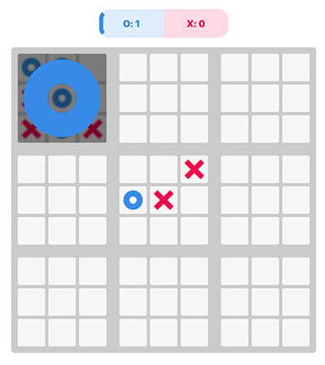

# Ultimate Tic Tac Toe Game

This is a game like Tic Tac Toe but there are nine grids instead of just one. Winning a grid earns a point and transforms the entire grid into a big sign representing the winning player. The objective is to accumulate the most points or achieve three big signs in a row to win the game.

I used HTML, CSS, JavaScript, and React to build this application.

